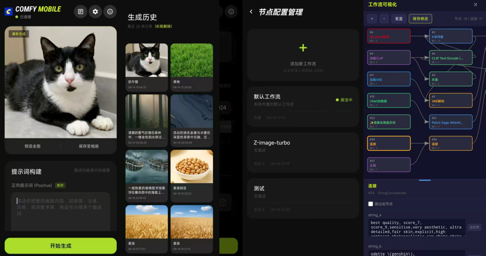
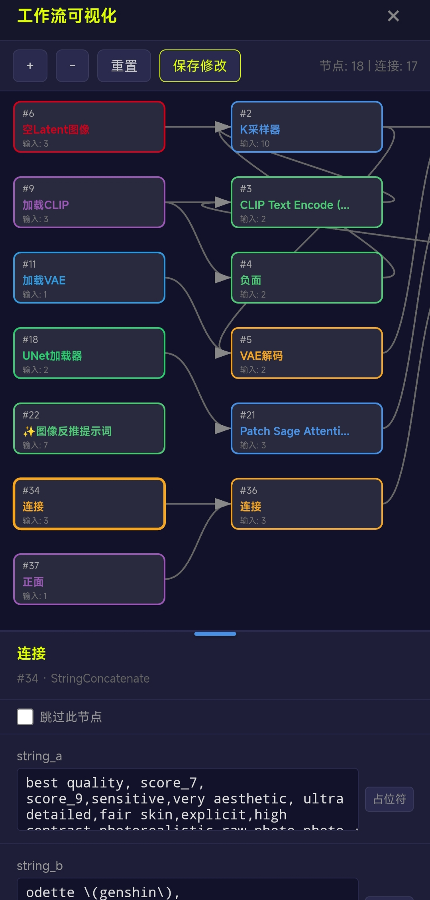

# ComfyUI Mobile

**版本：v0.1.0**

## 项目名称
**ComfyUI Mobile**

## 软件简介
ComfyUI Mobile 是基于 ComfyUI 的移动端应用，解决了移动端使用该项目生图的体验问题。
本版本（v0.1.0）新增了字符串替换功能，并修复了界面文字与背景颜色混淆的问题，同时优化了生成历史合集图片的操作体验。

## 主要功能
- 动态 UI 生成，实时渲染工作流节点
- 节点配置管理（新增、编辑、删除）
- 工作流可视化展示与交互
- 离线运行，支持本地保存与加载
- 主题与配色自定义
- **字符串替换功能**：支持在工作流中使用占位符（如 `%Prompt`、`%seed%` 等）动态替换节点参数，方便快捷地批量修改提示词与参数。
- **节点配置对话框优化**：优化节点配置管理中点击工作流时显示的选项菜单，工作流名字显示为蓝色（`#4a90e2`），更好分辨。
- **生成历史合集图片优化**：修复生成历史中合集图片无法放大和保存的 bug，现在合集中的图片支持点击放大和长按保存到相册，与单张图片保持一致的操作体验。
- **可视化工作流编辑器**：属性面板改为纵向底栏，可通过拖拽手柄调整高度，节点属性支持滚动查看与编辑，用于快速添加占位符。
- 
## 界面概览
主界面展示工作流概览与启动按钮，节点管理界面提供列表形式的节点配置编辑，设置界面支持主题切换与日志查看。




## 环境准备
- **JDK 17+**
- **Android Studio**：包含 Android SDK、NDK（可选）
- **Android SDK**：API 34 及以上
- **Gradle**：项目已 bundled `gradlew` 脚本，无需单独安装

## 构建方法

### 方式 1：Android Studio 运行（推荐）
1. 用 Android Studio 打开本工程根目录 `ComfyUI-Mobile/`
2. 同步 Gradle（首次同步需联网下载依赖）
3. 连接 Android 设备（或启动模拟器）
4. 点击 ▶️ 运行 `app` 模块

### 方式 2：命令行构建 Release APK
```bash
cd ComfyUI-Mobile
./gradlew assembleRelease
```
构建产物位于：

`app/build/outputs/apk/release/app-release-unsigned.apk`

### 方式 3：命令行构建 Debug APK
```bash
cd ComfyUI-Mobile
./gradlew assembleDebug
```
构建产物位于：

`app/build/outputs/apk/debug/app-debug.apk`

## 安装
- 下载 APK 文件，传输到 Android 设备上
- 在设备上安装（若提示未知来源，请在设置中开启）

## 最低系统要求
Android 6.0 (API 23) 及以上。

## 工程结构
```
ComfyUI-Mobile/
├── app/
│   ├── src/
│   │   ├── main/
│   │   │   ├── java/com/example/demo/    # 核心代码
│   │   │   ├── assets/                   # HTML 工作流编辑器等静态资源
│   │   │   └── res/                      # 布局、图片、样式
│   │   └── test/                         # 单元测试
│   └── build.gradle.kts                  # 应用模块构建配置
├── gradle/                               # Gradle 版本配置
├── build.gradle.kts                      # 项目级构建配置
├── settings.gradle.kts                   # Gradle 模块设置
├── gradle.properties                     # Gradle 属性
├── gradlew                               # Gradle 包装脚本 (Unix)
├── gradlew.bat                           # Gradle 包装脚本 (Windows)
└── README.md
```

## 技术栈
- Android Studio
- Kotlin / Java
- AndroidX
- Material Components
- Gradle Kotlin DSL

## 贡献指南
- 在 Fork 后提交 Pull Request。
- 遵循项目代码风格，使用 Android Studio 自动格式化。

## 许可证
本项目采用 [MIT License](LICENSE) 开源，欢迎共同维护。
